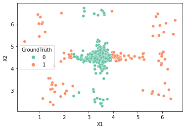
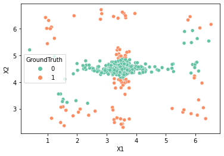

<h1><b>Rapport de projet – détection d’outliers par arbres de
décisions</b></h1>

## II - Données
1. *Combien y a-t-il de données dans chacune des classes ?*

Le set de données comporte 250 ***inliers*** et 80 ***outliers***, soit 330 exemples.

1. *Écrivez une fonction pour visualiser ces données (en utilisant seaborn
ou autre). Joignez une capture d’écran du résultat dans votre rapport.*

<ul>
<li>Accuracy :  0.9691417550626809</li>
<li>Weighted Accuracy : 0.5704305674365554</li>
</ul>

1. *Décrivez brièvement la forme des données.*

On peut constater que les données catégorisées comme ***inliers*** (*GroundTruth* = 0) sont regroupés au centre du graphe. Tandis que les ***outliers*** (*GroundTruth* = 1) sont dispérsées autour des Inliers.

## III - Évaluation
1. *À la seule lecture des coefficients, le modèle associé vous semble-t-il bon ?
Justifiez.*

Ce modèle arrive à prédire correctement un grand nombre d'***inliers***. Cependant il n'arrive à prédire correctement que 5 ***outliers*** avec 30 mauvaises prédictions. Donc ce modèle n'est pas bon.

2. *Calculez puis comparez l’exactitude et l’exactitude pondérée de cette
matrice. Commentez*

On obtient le pourcentage de l'exactitude ( les bonnes préditions ) d'environ 96.92%.
L'exactitude est très haute car le modèle prédit correctement presque tout les ***inliers*** qui consituent la quasi totalité des exemples. 
Par contre, on a obtenu le pourcentage d'environ 57% pour l'exactitude pondérée ( bonne prédictions pour chaque classe ), qui considère l'erreur sur les ***outliers*** avec un poids égal à celui des erreurs sur les ***inliers***, elle donne donc une mesure plus intéressante dans notre cas.

3. *Pourquoi l’exactitude donne un score aussi bon ?*

L'exactitude donne un score aussi bon car elle se base sur la majorité des données qui sont des ***inliers***, elle ne considère donc que très peu les ***outliers*** dans son calcul. Le modèle ne se trompe donc que très peu car presque tout les exemples sont des ***inliers***.

4. *En déduire pourquoi elle n’est pas pertinente dans notre cas*

Elle n'est pas pertinente dans notre cas car le dataset n'est pas balancé. Le nombre de données labelisés ***inliers*** est largement supérieur au nombre de données labelisé ***outliers***. 

## IV - Algorithmes

### 4.1  Arbre réduit à 1 feuille (classe DecisionLeaf)
3. *Évaluez le modèle appris.*

<ul>
<li>Weighted Accuracy :  0.758</li>
<li>Precision :  0.5490196078431373</li>
<li>Recall :  0.7</li>
</ul>

### 4.2  Arbre superficiel
3. *Évaluez votre modèle et discutez les résultats.*

<ul>
<li>Weighted Accuracy :  0.79425</li>
<li>Precision :  0.6477272727272727</li>
<li>Recall :  0.7125</li>
</ul>

L'évaluation obtenue du modèle est meilleure avec l'algorithme <b>ID3</b> puisqu'il permet de mieux englober les données en limitant l'utilisation d'un attribut à une seule fois. Les attributs sont donc tous pris en compte d'où l'augmentation de la précision.

### 4.3  Arbre généralisé
3. *Quelle hauteur vous semble donner les meilleurs résultats ?*

Avec hauteur = 1, les seuils, indices d'attribut et métriques sont identiques à celles obtenues dans la section 4.1. 
On constate de meilleurs résultats quand la hauteur = 2.

<table style="text-align:center;">
  <tr>
    <th></th>
    <th>Weighted Accuracy</th>
    <th>Precision</th>
    <th>Recall</th>
  </tr>
  <tr>
    <td><b>Height = 1<b></td>
    <td>0.75800</td>
    <td>0.549020</td>
    <td>0.7000</td>
  </tr>
  <tr>
    <td><b>Height = 2</b></td>
    <td>0.79375</td>
    <td>0.557522</td>
    <td>0.7875</td>
  </tr>
    <tr>
    <td><b>Height = 3<b></td>
    <td>0.55700</td>
    <td>0.287582</td>
    <td>0.5500</td>
  </tr>
    <tr>
    <td><b>Height = 4<b></td>
    <td>0.43400</td>
    <td>0.193939</td>
    <td>0.4000</td>
  </tr>
</table>

